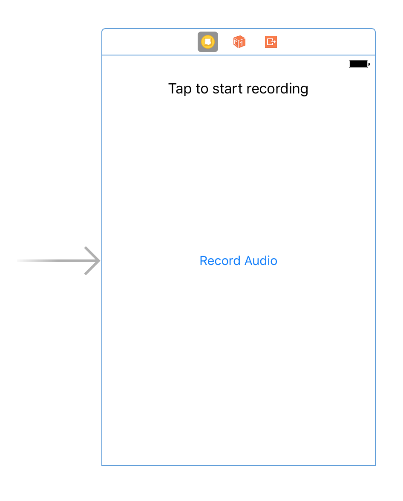

<!-- $size: 4:3 -->
<!-- page_number: true -->


# Swift Users Group
Host: Jarrod Parkes, parkesfjarrod@gmail.com
Date: March 28, 2017

--

Facebook: https://www.facebook.com/groups/HuntsvilleSwiftUsers/
GitHub: https://github.com/HuntsvilleSwiftUsers
Slack: tech256.slack.com, #swift-users-group

---

# Last Week

- Started building "Pitch Perfect" app in Xcode
- Discussed launch point for an app (`AppDelegate.swift`)
- **Model-View-Controller**: Created a simple model

<br>

```swift
struct Model {    
    let name: String
}
```

<br>

- **Model-View-Controller**: Created a view using Xcode's Storyboard
- **Model-View-Controller**: Created a (view) controller

---

# Last Week



---

# Today's Outline

- Discuss learnings about server-side Swift from IBM Interconnect 2017
- Continue building the "Pitch Perfect" app
	- Add second view
	- Transition between views using a navigation controller
	- Add images to project
	- Update model to contain audio file URL (path)
	- Save audio in RAM
	- Playback audio
- Plan for next meeting

---

# Next meeting?

Date: March 5th, 2017
Topic: TBD
